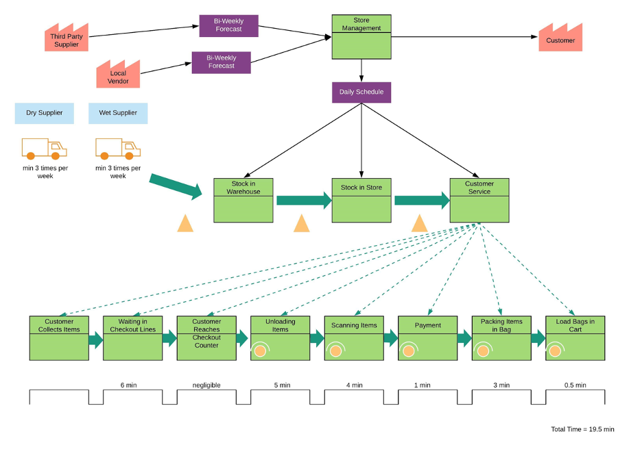

# LeanProcessImporovement

 Process Improvement at Indian Market

# Abstract

Every supermarket faces several issues and struggles to satisfy their customer. To improve the customer experience and to help clients in resolving their issues, the team has decided to work on the &quot;Indian Market&quot; located in Milpitas. The primary focus of this project is to increase the customer satisfaction by reducing the time for the checkout process using different Lean Six Sigma techniques. The team focused on optimizing the store layout by arranging and displaying the items in an efficient manner. This will help customers to get hold of the required items instead of wandering in the store. The supermarket faces issues regarding the stockouts and excess inventory because of unpredictable customer demand. So, the team used a forecasting method that will help client to maintain an appropriate stock in the supermarket- to avoid stockouts and excess inventory. The team improved the process implementation and reduced the checkout time by almost 18% which further increased customer satisfaction and helped the client to gain more profits.

Keywords: supermarket, checkout time, lean, techniques, process implementation

# Introduction

&quot;Indian Market&quot; is a supermarket located in Milpitas. All essential food items are available at the store. They also have a food counter which is an attraction for many people. As they sell a variety of items, it becomes difficult for the customers to find the items they need from the store. Also, due to unpredictable demand and many other external factors, stockouts and excess of items need to be managed. The customers are thus not satisfied, as they need to wait for a long time in the checkout line. To increase the efficiency of the supermarket and gain more profits, the team decided to improve the overall process and make changes in the management with the help of Lean techniques.

# Problem Statement:

For any business, it is necessary to have good management of people, processes and technology to gain profit and satisfy customers. Supermarkets across the globe are facing several issues because customer expectations are changing due to the advent of new technologies. According to one survey in 2019, 51% of the consumers responded that if supermarkets do not find modern ways to serve them, they will find other options to buy groceries and food. When questioned about how technology should be used for improving customer experience, 89% customers want the checkout process to be faster while 83% want their shopping to be quick, without much waste of time (Redman, 2019). This survey shows that reducing checkout time and displaying items in an appropriate way can help the customers get hold of items easily which is very much necessary for supermarkets. Also, to increase their profits, inventory management is one of the major aspects which requires attention. Thus, it is important to solve all the three issues by using various Lean techniques.

# Problem solution using DMAIC approach:

For solving complex issues, one of the best methods that can be implemented is the DMAIC approach. This method can help in successful completion of a project as it provides a **continuous improvement platform**. This figure 1 (Swan, n.d.) below shows the stages involved in DMAIC, also some of the steps can be skipped based on the complexity of the problem.

_Figure 1: Steps involved in DMAIC approach_

# Phase 1 - Define

As per DMAIC, the first and the most important step is the Define phase which is important for knowing areas of improvement. Project charter was created for understanding the client requirements and to make sure that everyone is on the same page throughout this improvement process.

## Objective

The main objective of this project is to reduce the checkout time for customers by easing the checkout process. The current checkout process is tedious and time consuming as customers need to wait in line for a long time before reaching the cashier. Some of the customers who are already ready for checkout are trapped between customer&#39;s still shopping in between aisles. This is because there is no escape route in between and so the customer spends more time even before he reaches the checkout line. Also, more time is spent by the customer in searching the required items because of inappropriate arrangement of items. Hence, reducing this time is another objective of this project. The last goal is to manage the inventory by avoiding stockout or excess inventory.

## Deliverables

The deliverables for this project will be:

- Reducing overall checkout time by reducing time in individual steps like time to reach checkout line, unloading items from cart, billing time, packing time and again loading it to cart.
- Reducing time to search items by using Visual Management techniques such as 5s. Also, making sure that all items are in the most appropriate place by checking aisles after a regular time interval.
- Manage inventory by using appropriate forecasting methods based on customer demands.

## Resources

- Time available: 7 weeks
- Contact person: Owner of the store and staff members.
- Data: Collected from the Indian Market.
- Other: Lean Six Sigma resources available on canvas

## Project Plan

A Gantt chart is a type of bar chart used to represent a project schedule. It represents the tasks on the vertical axis and timeline on the horizontal axis. The team prepared a Gantt chart to demonstrate the schedule of the project to meet the deadlines. It helped the team to determine each activity and any interdependencies between the tasks throughout the project duration.This chart shows the progress and deadlines for efficient completion of the project. Figure 2 shows the Gantt chart for the project.

_Figure 2: Gantt chart for process improvement plan_

## Voice of Customer

Voice customer is important for understanding customer requirements and needs. Feedback from customers will help supermarkets to take action for process improvement. The team visited the supermarket in early February to take customer feedback by talking to them and collecting information about their usual takeaways from the supermarket and time spent once they entered the store. Table 1 below shows the observations for checkout time.

| **No** | **Metric** | **Current Time taken (mins.)** |
| --- | --- | --- |
| 1 | Waiting time in checkout line | 6 |
| 2 | Time to unload items from cart | 5 |
| 3 | Time taken for scanning items | 4 |
| 4 | Payment| 1 |
| 5 | Time to pack items in bag| 3 |
| 6 | Time to load bags in cart| 0.5 |

_Table 1: Current checkout time at the client organization_

## Pareto chart

Figure 3 below, highlights the important factors that impact the customer checkout time. It shows that customer wait time increases because of the various processes carried out before the customer leaves the supermarket.

_Figure 3: Pareto chart for current checkout time_

## SIPOC

It stands for Suppliers, Inputs, Process, Outputs and Customers. It provides a high-level view of how different processes work in any organization. It starts from Suppliers who provide inputs to the system, which is then processed, and final output is provided to customers. Thus, it focuses on identifying the aspects for which process improvement is needed (&quot;SIPOC&quot;, n.d.). For the Indian Market, the SIPOC was designed as shown in figure 4.

SIPOC constitutes of the following elements:

**Suppliers** : Identifying the third party or the local vendors from whom the supply is taken for required products/ items for the supermarket.

**Inputs:** Identifying the resources needed for the process to be carried out.

**Process:** Identifying the necessary steps for the process.

**Output:** Specific outcomes from the process

**Customer:** Identifying the customers

_Figure 4: SIPOC for client organization_

# Phase 2 - Measure

This phase is important in defining the initial point of comparison. It will allow the team to compare the existing system with the new system after implementing the lean solutions. Process flows, data collected from customers, value stream diagram for the current process is shown below.

## Before State Data Collection

A customer survey was done in February to take a note of the waiting time at the supermarket. It was found that most of the customers had to wait for a long time in the checkout line. Some of the customers also faced issues in finding all the items they needed as the items were not organized properly.

## Value Stream Mapping (Before implementation)

Value stream mapping is used to improve the entire workflow. This means it takes into consideration everything starting from raw materials to the final product/service. The goal here is to optimize the entire process. It is represented in the form of a flowchart that takes all the people, processes and inventories. This will help to analyze different areas of process. Value stream map will help in maximizing value, support clear communications and encourage continuous improvement which is one of the core principles of lean six sigma. Thus, value streams will be advantageous in reducing the cycle time and increasing the efficiency of the system. The current process contains different stages like shopping for items, waiting in check-out line, customer reaches check-out counter, unloading items, scanning items, payment, pack items in bags and load bags in cart (&quot;Value Stream Mapping,&quot;, 2019). Figure 5 below shows the value stream map before improvement techniques were applied for the supermarket.

_Figure 5: Value Stream Mapping (Before Implementation)_

# Phase 3 – Analyze

The analyze phase will be useful in determining the root cause of the problems that we came across during the define and measure phase. This phase will help in determining the reasons behind large checkout time and unmanaged inventories. The techniques used for determining problems are 5 Why, Ishikawa Diagram and Data validation using Hypothesis Testing.

## 5 Whys

5 Why technique helps in determining the root cause of the problem. It is also beneficial for finding the relation between different problems.

**Problem statement 1: Customers are unhappy because several items remain out of stock.**

1. Why are customers unhappy?

- Because they are not getting the required items when they visit the store.

2. Why are they not getting required items?

- Because inventory management is not appropriate.

3. Why is inventory not managed properly?

- Because there is not enough information about customer demands.

4. Why is there no information about customer needs?

- Because customer demands are unpredictable and so the store is not able to estimate the exact requirements.

5. Why is the store not able to predict exact requirements?

- Because there is no appropriate forecasting model that can satisfy the customer demands.

**Problem Statement 2: Customers have to spend more time in the checkout process.**

1. Why is customer checkout time longer?

- There are a smaller number of checkout counters and so wait time

is more, mainly during the rush hours.

2. Why is wait time more during rush hours?

- There is no appropriate checkout process.

3. Why is there no proper checkout process?

- The store does not have self-checkout counters and so customers who wish to do self-checkout, need to stay in line doing nothing.

4. Why there are no self-checkout counters?

- The store is not using any advanced technologies that support the self-checkout process.

5. Why is the store not using any new technologies?

- There is not enough space in store to include any new counters as layout is cluttered.

## Ishikawa diagram

Ishikawa diagram which is also referred as Fishbone diagram is used to identify the causes for the different problems. It gives visual representation of possible cause of a problem, factors affecting the problems and solutions to resolve them. The root cause analysis gave a clear idea for a long checkout time at the supermarket. The four major causes were: Manpower, Materials, Management and Inventory. Figure 6 shows the Ishikawa diagram for the supermarket.

_Figure 6: Ishikawa diagram_

**Materials:** As the items arrive in the warehouse from the supplier, there were quality issues like
 items getting damaged either during transportation or due to improper packaging. The management should suggest a change in mode of transportation and ensure proper packaging of items. This will help in getting good quality products which will reduce the waste due to damaged items.

**Inventory:** As there was no particular forecasting method followed for ordering the items, the supermarket faced inventory management issues. The items were ordered without any proper schedule due to which the store faced stockouts and excess of inventory. To avoid stockouts for milk cans, butter and yogurt, weekly forecasting should be done as it is high in demand.

**Manpower:** The employees working in the store were less knowledgeable about the software used at the store for the checkout purpose. This increased the customer checkout time as employees took more time for payments and scanning. If there are stock outs in the store, employees need to get the required items from the warehouse while the customer is waiting for checkout. This again led to an increase in customer checkout time.

**Management:** Not every customer buys a large number of items. If a customer has less items for checkout, then he/she usually spends more time in the checkout line as compared to the time spent in shopping. So, it would be very convenient for the customers to have a separate checkout counter for customers having less than ten items. Also, having a self-checkout counter will save time for customers waiting in the checkout line.

**Data collection:**

Considering the current situation, the team asked the client to measure the average checkout time instead of measuring the time for each process individually for hypothesis testing as the team was not able to visit the store frequently.

**Normality test:**

It is essential to check for the normality of the data before proceeding for hypothesis testing. Figure 7 and Figure 9 shows the histogram and probability plot before implementing the Lean techniques. The data is approximately normal with 95% level of confidence.

## Hypothesis Testing

For hypothesis testing, the team collected the 20 data points before and and after implementing Lean techniques. As the sample size was less than 30, it was necessary to conduct a normality test for hypothesis. As there were two sets of data, one before implementation and one after implementing lean techniques, a paired t-test was performed on them to determine the mean difference between the two sets.

Hypothesis Statement:

Null hypothesis: The difference in average checkout time per customer is not statistically significant.

Ho: µ1 = µ2

Alternate statement: The difference in average checkout time per customer is statistically significant.

H1: µ1 ≠ µ2

Test statistic calculations for the dependent t-test:

T0 = (D - (µ1- µ2)) / (Std Dev/ sqrt(n))

T0 = 8.33219155

Here, T0 \&gt; Tcritical. So, the null hypothesis will be rejected. This means that the difference in average checkout time per customer is statistically significant.

The calculation for the hypothesis testing is shown in appendix.

Figure 8 and Figure 10 shows the histogram and probability plot after implementing Lean techniques.

_Figure 7: Histogram of average checkout time before implementation_

_Figure 8: Histogram of average checkout time after implementation_

_Figure 9: Probability plot of average checkout time before implementation_

_Figure 10: Probability plot of average checkout time after implementation_

Figure 11 and Figure 12 shows the boxplot of average checkout time before and after implementing Lean techniques. This plot is useful for checking the spread of the data and also to observe if there are any underlying outliers present in the data.

_Figure 11: Boxplot for average checkout time before implementation_

_Figure 12: Boxplot for average checkout time after implementation_

## Forecasting

It is very essential to predict the exact customer demands and understand the trends so as to cope up with the fluctuating demands. Forecasting methods will predict the demands accurately which will help the client to avoid excessive inventory and frequent stockouts. It will give a clear idea about what to purchase and when to purchase by using appropriate forecasting methods. Currently, they are ordering the items based on approximation because of which sometimes there is excess inventory. The team provided a solution where they can study the historical data and predict the future demands using a method called Moving average. It is important to predict the correct demands for dairy products as excessive order for these items will result in wastage since customers will not buy expired products. Figure 14, 15 and 16 shows the actual vs forecasted demand for three products- Milk, Butter and Yogurt respectively, that are consumed on a regular basis. The team collected the data for 10 weeks and predicted the demand using 2 weeks moving average.

_Figure 13: Actual Vs Forecasted demands for Milk_

_Figure 14: Actual Vs Forecasted demands for Butter_

_Figure 15: Actual Vs Forecasted demands for Yogurt_

# Phase 4 – Improve

The process improvement was suggested to the owner through Zoom meetings to implement in the supermarket.

## 5S

5S is a lean technique used in almost every workplace. It involves removing the unnecessary things, organizing the essentials, cleanliness and regularly performing the same tasks (&quot;What is 5S&quot;, n.d.). It is very important to repeat this cycle on a regular basis. This can also be done at the storage inventory/warehouse where the items are stored. 5S was implemented in the supermarket as discussed below.

1. **Seiri (Sort)** - Removing all the unnecessary items from the store to make it easier for the management and the customer to get what they need. An easy way to sort things out is by analyzing the purpose of the item and the frequency of the usage. This can create room for other necessary items. The next step would be to deal with the unwanted items. An unwanted item should be either destroyed or may be replaced or moved out to some other place (warehouse). The expired food items need to be thrown away as waste and excess of any items like any vegetables or fruits can be moved to the warehouse.

2. **Seiton (Set in order)** - Arrange all the necessary items to be easily accessed by the customers. In the store, all the similar items should be grouped by type. For example, vegetables, fruits, bakery items, dry snacks, frozen items, desserts, etc. There should be a logical reasoning for arranging all items and thus, every item should be arranged so that it&#39;s more intuitive for the customers to find anything. For example, milk should be placed somewhere near yogurt, as there is a general tendency to pick both of them together.

3. **Seiso (Shine)** - Maintain regular cleanliness and hygiene in the store. It is very important to clean the work and storage area by regularly sweeping, mopping and sanitizing. Along with cleaning the work area, shopping baskets should also be cleaned on a regular basis and a timely maintenance of the shopping carts should be performed.

4. **Seiketsu (Standardize)** - Once the above three steps are completed, it&#39;s important to put it in a daily practice. It creates schedules for performing regular tasks daily. Once it becomes a habit, it becomes a part of regular work.

5. **Shitsuke (Sustain)** - The sustain refers to running the 5S technique and involving everyone to perform the tasks. 5S should be sustained for a long term as a clean and organized store will attract more customers and thus positive results can be obtained.

## FMEA (Failure Mode Effect Analysis)

It is a six-sigma tool which helps to analyze the potential failures and its causes. This further helps in analyzing the actions required to be taken for particular failure and prevent the causes. FMEA provides a quantitative analysis that the effects have on the identified failures. It gives an understanding of the impact the systems will have to bear due to the failures. The quantitative analysis helps in identifying the priority of a high-risk failure (&quot;Failure mode and effects analysis&quot;, n.d.).

Table 2 shows the FMEA implemented for the client. The key process steps are taken into consideration and the potential failure mode, effects and causes are identified. For each process, a score is computed for severity, occurrence and detection of the failure. RPN (Risk Priority Number) is the product of these computed numbers.

| Sr No | Key Process step/input | Potential Failure Mode | Potential Failure Effects | SEV | Potential causes | OCC | Current Controls | DET | RPN | Actions | Response |
| --- | --- | --- | --- | --- | --- | --- | --- | --- | --- | --- | --- |
| 1 | Inventory | Excess Inventory | Wastage of items | 7 | Lack of appropriate forecasting methods | 4 | Weekly order of items | 7 | 196 | Provide appropriate forecasting methods and check inventory before ordering | Manager |
|  |  Inventory | Stockout of items | Customer needs not satisfied | 6 | Lack of appropriate forecasting methods | 3 | Order when need arises | 8 | 144 | Checking inventory on regular basis and order based on forecasting methods | Manager |
| 2 | Materials | Quality issues | Get rid of damaged items | 6 | Damage in transportation | 3 | No control | 3 | 54 | Ensure proper packing of items to avoid damage at arrival | Management |
| 3 | Management | More waiting time in checkout line for customer with less than 10 items | More time in checkout line | 8 | Same checkout counters for all customers | 5 | No control | 5 | 200 | Separate checkout counter required for less than 10 items | Management |
| 4 | Manpower | Less knowledge to operate store management software | More time for customer checkout | 7 | Untrained employees | 4 | No control | 8 | 224 | Provide training to employees | Manager |

_Table 2 : FMEA for the client organization_

## After state data collection

Table 3 shows the improved waiting time and the percentage after implementing the Lean techniques. The team was able to reduce the time to unload the items by making sure that only small items are unloaded from the cart and big items are scanned in the cart itself. This in turn will reduce the time to scan the items as items in cart will be adjusted such that bar code is seen clearly for scanning purpose. Additionally, the time is reduced for packing the items in the bag as only a few small items are removed from the cart and so only those items require packing. In this way, the team was able to reduce the average checkout from 19.5 minutes to 16 minutes.

| **No** | **Metric** | **Current time taken (mins.)** | **Goal (mins.)** | **Improvement** |
| --- | --- | --- | --- | --- |
| 1 | Average Waiting time in checkout line| 6 | 6 | 0 |
| 2 | Time to unload items from cart| 5 | 3.5 | 30% |
| 3 | Average Time taken for scanning items | 4 (up to 20 items)| 3.5 | 12.5% |
| 4 | Payment | 1 | 1 | 0 |
| 5 | Time to pack items in bag | 3 | 1.5 | 50% |
| 6 | Time to load bags in cart | 0.5 | 0.5 | 0 |
| 7 | Total average checkout time | **19.5** | **16** | **17.95%** |

_Table 3: Reduced Checkout Time after implementing Lean techniques_

## Value Stream Mapping (After Implementation)

Figure 15 shows the value stream map after implementing lean techniques. It clearly shows how the team was able to reduce the average checkout time by reducing the time in individual process.

_Figure 16: Value stream mapping after implementation_

# Phase 5 – Control

The control charts show the changes in the process over time by measuring the variability in the consecutive data points. Thus, these charts monitor the effects of the implemented process improvement. The team recorded the checkout time for 20 observations and used the MR chart to compute the average checkout time. The average checkout time before implementation is represented in figure 16 using MR chart and the average checkout time turned out to be 19.5 minutes and the moving average was 3.71 minutes. The average checkout time decreased to 16 minutes after implementation and the moving average was 3.27 as shown in figure 17.

_Figure 17: Control chart for average checkout time before implementation_

_Figure 18: Control chart for average checkout time after implementation_

Environmental effects of before and after implementation:

- Use of recycle bags in place of plastic bags
- Excess inventory

# Conclusion and Recommendations

The team recorded sample data from the customers for process improvement in the supermarket and
provided solutions to existing issues using Lean Six Sigma techniques considering the time, unseen
circumstances and other constraints of the project. DMAIC approach was followed for the entire
project to implement the process improvement in an acceptable manner. Hypothesis testing was carried
out to verify the statistical significance of the recorded data and other lean techniques were
implemented as a possible solution for all the problems faced by the supermarket. One of the
difficulties was the increasing checkout time because of which customers were utterly disappointed.
The customer checkout time consists of the time when he/she reaches the checkout line till, he/she
leaves the supermarket. The team identified this issue using the root cause analysis and recommended
the client to reduce the time for individual processes by keeping heavy items in the cart and complete
their scanning process in the cart itself. This will reduce the time caused by movement of heavy items
and in turn will help them to reduce the overall checkout time. After observation, it was also found that
the employees were not properly trained to use the software used for checkout due to which the
customers had to wait for the employee to scan and provide a receipt. The team suggested training the
employees to lessen the waiting time. Second, clients faced inventory management issues because of
which sometimes there were excess inventories while rest of the time there were stockouts of items.
As a solution, the team came up with a moving average forecasting method of two weeks which gave
a clear understanding of the inventory management. By using this method, the supermarket avoided

wastage and scarcity of items. Additionally, customers were not satisfied because the items in the store
were not organized properly. The team suggested implementing 5S as a good practice for better
organization and maintain a clean environment in the supermarket which can attract new customers
and retain the existing ones.

Thus, the process improvement suggested by the team will aid in increasing the profitability of the
supermarket. Also, the reduction of waste will help the supermarket to be environmentally friendly.